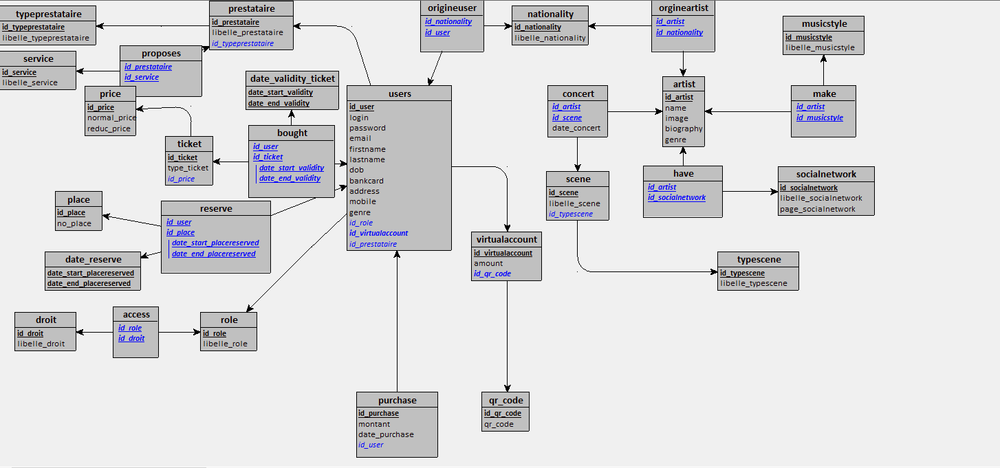

# Informations sur le MCD et le MR

Notre base a été modifié à de nombreuses reprises, mais voici le rendu final :

Pour plus de facilité vous pouvez télécharger le fichier looping .loo ici : 

/rendus/MCD_MR/MCD_SAE_Groupe6.loo

Voici à quoi ressemble notre MCD :


Et voici notre MLD avec en dessous notre MR :



```
artist = (id_artist INT, name VARCHAR(50), image VARCHAR(255), biography TEXT, genre VARCHAR(10));
nationality = (id_nationality INT, libelle_nationality VARCHAR(50));
musicstyle = (id_musicstyle INT, libelle_musicstyle VARCHAR(50));
socialnetwork = (id_socialnetwork INT, libelle_socialnetwork VARCHAR(50), page_socialnetwork VARCHAR(50));
typescene = (id_typescene INT, libelle_typescene VARCHAR(50));
role = (id_role INT, libelle_role VARCHAR(50));
typeprestataire = (id_typeprestataire INT, libelle_typeprestataire VARCHAR(50));
service = (id_service INT, libelle_service VARCHAR(50));
qr_code = (id_qr_code INT, qr_code TEXT);
droit = (id_droit INT, libelle_droit VARCHAR(50));
date_validity_ticket = (date_start_validity DATE, date_end_validity DATE);
price = (id_price INT, normal_price DECIMAL(15,2), reduc_price DECIMAL(15,2));
place = (id_place INT, no_place VARCHAR(255));
date_reserve = (date_start_placereserved DATE, date_end_placereserved DATE);
scene = (id_scene INT, libelle_scene VARCHAR(50), #id_typescene);
prestataire = (id_prestataire INT, libelle_prestataire VARCHAR(50), #id_typeprestataire);
virtualaccount = (id_virtualaccount INT, amount DECIMAL(15,2), #id_qr_code);
ticket = (id_ticket INT, type_ticket VARCHAR(50), #id_price);
users = (id_user INT, login VARCHAR(50), password VARCHAR(255), email VARCHAR(50), firstname VARCHAR(50), lastname VARCHAR(50), dob DATE, bankcard VARCHAR(50), address VARCHAR(50), mobile VARCHAR(10), genre VARCHAR(10), #id_role, #id_virtualaccount, #id_prestataire*);
purchase = (id_purchase INT, montant INT, date_purchase DATE, #id_user);
orgineartist = (#id_artist, #id_nationality);
make = (#id_artist, #id_musicstyle);
have = (#id_artist, #id_socialnetwork);
concert = (#id_artist, #id_scene, date_concert DATE);
origineuser = (#id_nationality, #id_user);
proposes = (#id_prestataire, #id_service);
access = (#id_role, #id_droit);
bought = (#id_user, #id_ticket, #(date_start_validity, date_end_validity));
reserve = (#id_user, #id_place, #(date_start_placereserved, date_end_placereserved));
```